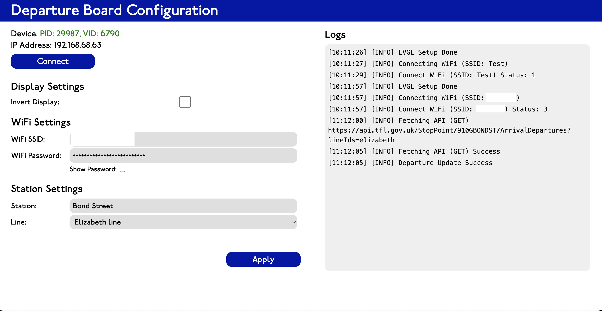

# Departure Board Configuration Web

## Description

This web application is designed for configuring [Departure Board](https://github.com/shr00m335/departure-board) a ESP32 powered real time departure board.

## How it works?

It connects with the ESP32 using [WebSerial](https://developer.mozilla.org/en-US/docs/Web/API/Web_Serial_API) and sends predefined commands to it.

See [Communcation Specification](USB-Communication.txt) for more details
